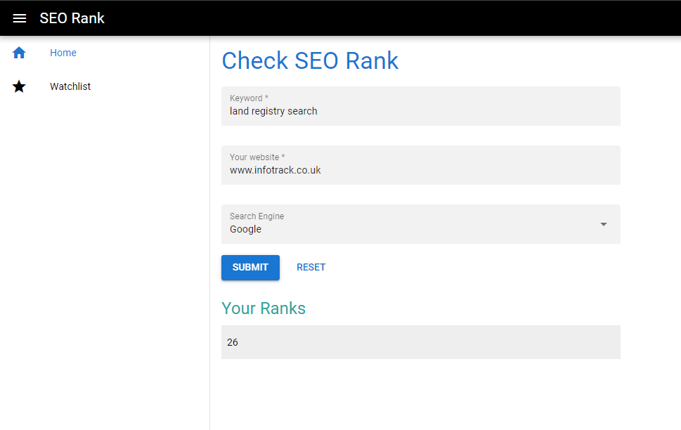

# SEO Rank

A small app that receives a string of keywords, and a string URL. This is then processed to return a string of numbers for where the resulting URL is found in Google. For example “1, 10, 33” or “0”.

- [x] Supported search engines: Google and Bing
- [x] Historical rank on a daily basic
- [x] Built on ASP .Net Core API and Quasar (Vue)




## Getting Started

To get a local copy up and running follow these steps.

### Prerequisites

- .Net 8 SDK
- SQL Server Express
- Node 16 or higher
- Yarn

### Run BE

```
cd SeoRankTask/src/SeoRankTask.Api
dotnet build
dotnet run
```

The API app should run on http://localhost:5075

### Run FE

```
cd SeoRankTask/src/client-app
yarn
yarn quasar dev
```

The browser should be open at http://localhost:9000

## Notes

- There is a timer background job to check and update ranks of items in the check list. However, for the demo purpose, I have seeded data for the chart on the "Checklist" page.
- Search engines use user's location, search history, and search settings to return different search results to different users. The app do a search without that user context. Therefore, you may found the rank is not the same as yours.
